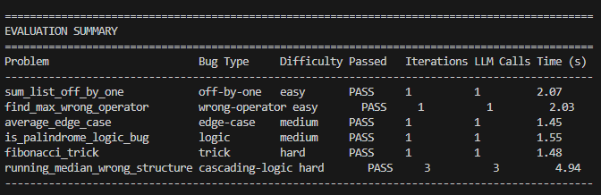

# Self-Healing Code Fixer (Reflexion Agent)

---

## Design Choices

### Critic: Programmatic (not LLM-based)

I chose that the critic node is fully programmatic (meaning no LLM call is made) since the test execution already produces a direct response. Either  "ALL TESTS PASSED" is in stdout, or its not. There is no need for an LLM to reason about anything. Also adding an LLM critic would cost tokens and latency with no added use because the generator already receives the stderr/stdout. The critic's job is deciding what to do next based on the test output, not reasoning, so the flow is as follows if 'passed == True' then go to END, and if 'iteration >= max_iterations also go to END, else we go back to generator.

### What I put in the State Fields and why

`buggy_code`: Preserved as a reference so it prevents the LLM from being side tracked from the original problem

`current_code`: Extracted from the LLM response into a field on its own so 'run_tests' doesnt have to parse code out of the message string

`test_code`: Gets passed to both 'run_tests' and the generator prompt

`test_output`: The stderr/stdout from the last run fed into the next generator prompt so the LLM sees the real error 

`iteration`: increases the counter to prevent looping forever 

`passed`: Flag set by 'run_tests_node' to be read by 'should_continue' to route the graph to the next correct state

`messages`: uses 'Annotated[list, operator.add]' so LangGraph appends instead of replacing allowing us to have a full conversation trace

### Termination Conditions I used

Two termination conditions: that all tests pass, and 'iteration >= max_iterations'. The budget cap is a must as without it the LLM might loop forever

---

## Results

**Interpretation:** The agent solved 6/6 problems, I added an extra complex problem 6 because the 5 I chose were too easy for the model I chose and fixed them all in one iteration showing  that llama-3.3-70b-versatile is a powerful model to catch bugs like : wrong operator, logic like palindrome and off-by-one directly from the code without needing test failure feedback. 
However, Problem 6 required 3 iterations hence exceting the Reflexion agent
The agent needed to see the real test failures before it could identify which of the two bugs 
to fix first. This shows the main idea behind Reflexion which is feedback 
from the test execution guides the generator to the correct fix where reading the code on its own wouldnt be enough
---

## Failure Mode in Detail

**Problem:** Running median, given a list of numbers, return a list where each element is the median of all numbers seen so far and for an even count, return the lower of the two middle values.

### What Happened Across Iterations

**Iteration 1**
The generator received the buggy function and returned a candidate which was incorrect as the even count median logic produced the wrong middle value.

The critic marked the failure and went back to the generator with the traceback.

**Iteration 2**
The generator returned another candidate and the same assertion failed so the critic again went back to the generator.

**Iteration 3**
The generator returned a revised candidate and all tests passed so the critic routed to END.

### Failure Analysis

**What went wrong:** The LLM at the start didnt adhere to the even count median rule. It didnt return the lower of the two middle values. Iteration 2 made minimal change so it failed again.On iteration 3 (with a larger candidate lenght of characters) the test passed.

**What would fix it:** A critic that isolates the specific failing point and gives only that part back instead of the full traceback, this would make the generator focus on the even count issue quicker.This is actually teh second stretch goal that could be future work for me.

**The full output:**
======================================================================
PROBLEM 6/6: running_median_wrong_structure
  Bug type:   cascading-logic
  Difficulty: hard
  Notes:      CASCADING TRAP: Bug: uses mean of two middle values instead of lower middle for even-length windows....
======================================================================

############################################################
# Starting Reflexion Agent (budget: 5 iterations)
############################################################

============================================================
[GENERATOR] Iteration 1 — requesting fix from LLM...
[GENERATOR] Received candidate code (311 chars)
[RUN_TESTS] Executing candidate code against test suite...
[RUN_TESTS] Tests failed. Output:
STDERR:
Traceback (most recent call last):
  File "C:\Users\KHADIJ~1\AppData\Local\Temp\tmpc9m7ttku.py", line 13, in <module>
    assert running_median([1, 3]) == [1, 1]
           ^^^^^^^^^^^^^^^^^^^^^^^^^^^^^^^^
AssertionError

[CRITIC] Iteration 1/5 — passed=False
[CRITIC] Tests failed, budget remains — routing back to generator.

============================================================
[GENERATOR] Iteration 2 — requesting fix from LLM...
[GENERATOR] Received candidate code (311 chars)
[RUN_TESTS] Executing candidate code against test suite...
[RUN_TESTS] Tests failed. Output:
STDERR:
Traceback (most recent call last):
  File "C:\Users\KHADIJ~1\AppData\Local\Temp\tmpxnib6a_y.py", line 13, in <module>
    assert running_median([1, 3]) == [1, 1]
           ^^^^^^^^^^^^^^^^^^^^^^^^^^^^^^^^
AssertionError

[CRITIC] Iteration 2/5 — passed=False
[CRITIC] Tests failed, budget remains — routing back to generator.

============================================================
[GENERATOR] Iteration 3 — requesting fix from LLM...
[GENERATOR] Received candidate code (400 chars)
[RUN_TESTS] Executing candidate code against test suite...
[RUN_TESTS] All tests passed!

[CRITIC] Iteration 3/5 — passed=True
[CRITIC] All tests pass — routing to END.

[RESULT] PASS | iterations=3 | llm_calls=3 | time=4.94s

---

## Reflexion vs. Supervisor

I would use reflexion when the goal targeted is cheap and automatic like this case where were only running a test suite that runs in milliseconds and produces a binary output. If I add a supervisor it  would be just extra overhead as theres only one task, only one tool and the feedback loop is simple that a single generator can correct istelf. I would use a supervisor/orchestrator when the problem is complex enough and can be broken down to different subtasks that need different tools or agents.For example, a travel agent that needs a hotel booking agent, a flight booking agent, and an itinerary agent all working in parallel and focused on their task and then communicate back to the supervisor. If we had to have the agent write the tests and and then fix the code, then I couldve used a supervisor between different agents.